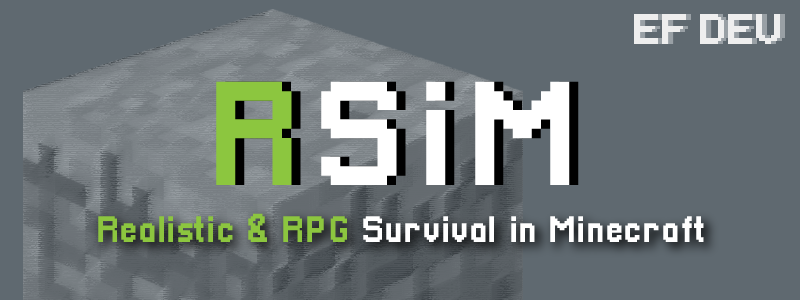

<!-- PROJECT LOGO -->
 

  

  <h3 align="center">Realistic Survival in Minecraft</h3>

  

    RPG 요소와 새로운 성장 시스템
     
     
    <a href="https://github.com/epochflow/Realistic-Survival-in-Minecraft/issues">버그 제보</a>
    ·
    <a href="https://github.com/epochflow/Realistic-Survival-in-Minecraft/issues">기능 건의</a>
  

<!-- ABOUT THE PROJECT --><!-- PROJECT SHIELDS -->
##

[![Contributors][contributors-shield]][contributors-url]
[![Stargazers][stars-shield]][stars-url]
[![MIT License][license-shield]][license-url]
[![Release][release-shield]][release-url]

<!-- CONFIG -->
## 설정

<!-- USAGE EXAMPLES -->
## 사용법

<!-- ROADMAP -->
## 로드맵

<!-- CONTACT -->
## 문의

EpochFlow 팀 - epochflow@gmail.com

<!-- ACKNOWLEDGEMENTS
* [GitHub Emoji Cheat Sheet](https://www.webpagefx.com/tools/emoji-cheat-sheet)
* [Img Shields](https://shields.io)
* [Choose an Open Source License](https://choosealicense.com)
* [GitHub Pages](https://pages.github.com)
* [Animate.css](https://daneden.github.io/animate.css)
* [Loaders.css](https://connoratherton.com/loaders)
* [Slick Carousel](https://kenwheeler.github.io/slick)
* [Smooth Scroll](https://github.com/cferdinandi/smooth-scroll)
* [Sticky Kit](http://leafo.net/sticky-kit)
* [JVectorMap](http://jvectormap.com)
* [Font Awesome](https://fontawesome.com)
-->

<!-- MARKDOWN LINKS & IMAGES -->
<!-- https://www.markdownguide.org/basic-syntax/#reference-style-links -->
[contributors-shield]: https://img.shields.io/github/contributors/epochflow/Realistic-Survival-in-Minecraft?color=Green&style=flat-square
[contributors-url]: https://github.com/othneildrew/Best-README-Template/graphs/contributors
[stars-shield]: https://img.shields.io/github/stars/epochflow/Realistic-Survival-in-Minecraft?style=flat-square
[stars-url]: https://github.com/epochflow/Realistic-Survival-in-Minecraft/stargazers
[license-shield]: https://img.shields.io/github/license/epochflow/Realistic-Survival-in-Minecraft?style=flat-square
[license-url]: https://github.com/epochflow/Realistic-Survival-in-Minecraft/blob/master/LICENSE.txt
[release-shield]: https://img.shields.io/github/v/release/epochflow/Realistic-Survival-in-Minecraft?style=flat-square
[release-url]: https://github.com/epochflow/Realistic-Survival-in-Minecraft/releases
